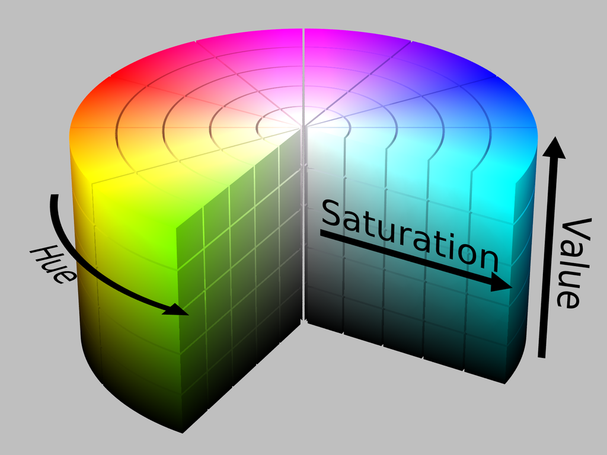
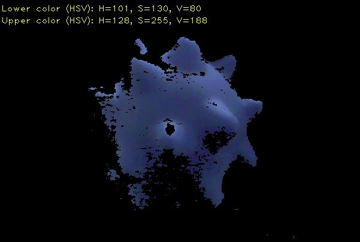
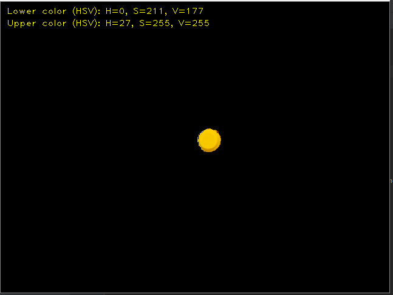
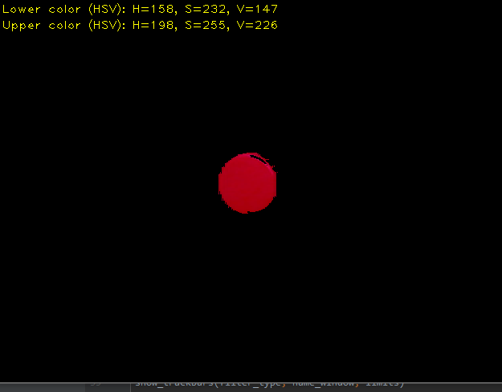
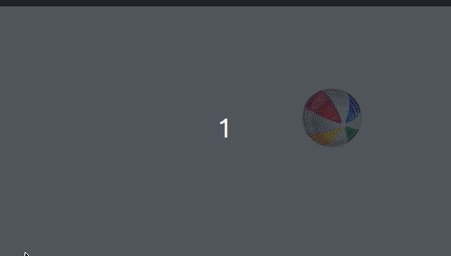

# Reconhecimento de cores com OpenCV 4.1.1
# *** EM DESENVOLVIMENTO ***

 O objetivo deste projeto é realizar alguns estudos/testes na área de visão computacional, especialmente em reconhecimento das cores de objetos. 

 Nesse estudo vamos utilizar a biblioteca <b> OpenCV (versão 4.1.1) </b> para realizar alguns testes de reconhecimento de cores. 

 Os exemplos utilizados neste estudo foram baseados nos sites: 

https://opencv-python-tutroals.readthedocs.io/en/latest/py_tutorials/py_tutorials.html

https://blog.socratesk.com/blog/2018/08/16/opencv-hsv-selector

## Informação sobre os arquivos:

 <b>segmentacao_cores.py </b> - Esse é o programa principal que realiza o reconhecimento das cores. 

 <b>encontrar_valores_hsv.py </b> - Esse programa ajuda a encontrar valores de limite HSV da cor que deseja reconhecer. 
Esses valores serão utilizados nas variáveis <b>lower_XXX </b> e <b> upper_XXX</b> do programa <b>segmentacao_cores.py </b> 

 É importante ter que em mente que a luz do ambiente influencia diretamente na variação das cores que estamos mapeando os limites.

 "HSV é a abreviatura para o sistema de cores formadas pelas componentes Hue, Saturation e Value." (https://pt.wikipedia.org/wiki/HSV). 
Onde:  H = Hue (matiz), S = Saturation (saturação) e V = Value (valor). 

##### Abaixo temos uma representação do modelo de cores HSV:

*imagem retirada do site https://blog.socratesk.com/blog/2018/08/16/opencv-hsv-selector*
 
##### Exemplo da seleção dos limites de agumas cores:

**Azul**   

**Amarelo**   

**Vermelho**   

   

##### Exemplo de cores reconhecidas:

