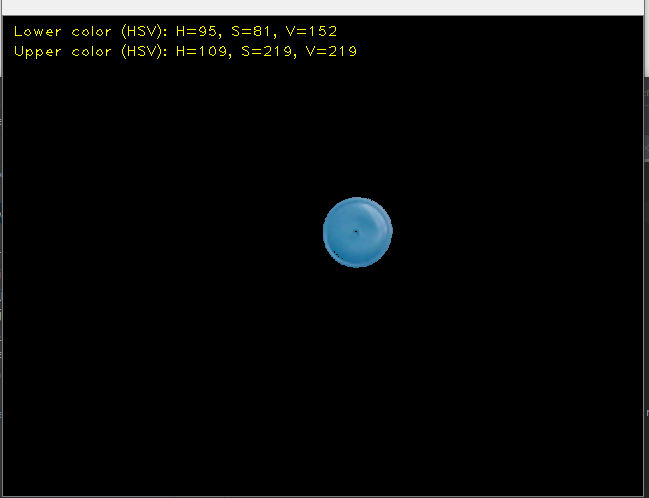

# Reconhecimento de cores com OpenCV 4.1.1
# *** EM DESENVOLVIMENTO ***

 O objetivo deste projeto é realizar alguns estudos/testes na área de visão computacional, especialmente em reconhecimento das cores de objetos. 

 Nesse estudo vamos utilizar a biblioteca <b> OpenCV (versão 4.1.1) </b> para realizar alguns testes de reconhecimento de cores. 

 Os exemplos utilizados neste estudo foram baseados no site: 

https://opencv-python-tutroals.readthedocs.io/en/latest/py_tutorials/py_tutorials.html

## Informação sobre os arquivos:

 <b>encontrar_valores_hsv.py </b> - Esse programa ajuda a encontrar valores de limite HSV, onde H = Hue (matiz), S = Saturation (saturação) e V = Value (valor), da cor que deseja reconhecer. Esses valores serão utilizados nas variáveis <b>lower_XXX </b> e <b> upper_XXX</b> do programa <b>segmentacao_cores.py </b> 

##### Exemplo da seleção dos limites para a cor azul:

   

 <b>segmentacao_cores.py </b> - Esse programa realiza o reconhecimento das cores. 

##### Exemplo de cores reconhecidas:

